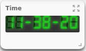
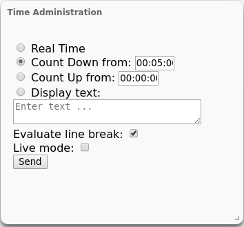
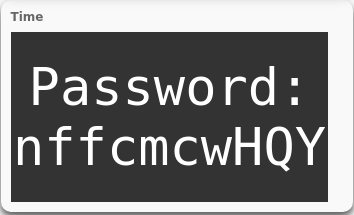

# NinjaDVA-clock
A clock widget with countdown based on nodejs + ws

The **NinjaDVA-clock** module is the free Clock, Countdown and Sendtext extension for **NinjaDVA**.

It is based on Websockets and includes a Security Misconfiguration vulnerability.

## Usage

After starting the module, you will find the clock on the dashboard.



Activating the admin interface at the dashboard, you will see a *Time Administration* widget.



Having that, you can change the operation mode of the clock for all participants.
Currently there are 4 modes implemented:

* Real Time --- showing the current time
* Count Down --- Counting down in one second steps (starts Count Up in red when reaching 0)
* Count Up --- Counting up in one second steps
* Display Text --- Shows an arbitrary text to the participants

The display text feature was developed to allow the administrator to send short text snippets to the participants like passwords or hints.



You can activate and deactivate the evaluation of newline characters. In live mode every single change of the text will be send immediately to the participants. Do not use it, if you have many participants because this could flood the network with messages.

## Vulnerability
The **NinjaDVA-clock** has a build in Security Misconfiguration vulnerability. Under [http://clock.mgmsp-lab.com/administr8/admin.js](http://clock.mgmsp-lab.com/administr8/admin.js) you can find the method that is used by the administration widget. Having that, an attacker can get an idea how to send commands and custom css to the clock of the participants.

Opening a console at [http://clock.mgmsp-lab.com/clock.html](http://clock.mgmsp-lab.com/clock.html) an attacker can send following examples to all other participants including the trainer:
```
connection.send(JSON.stringify({"method": "displayText", "text": "solution is 1234", "custom_css": "body \{color: red;\}"}))
connection.send(JSON.stringify({"method": "countUp", "start": "12:33:12"}))
```
The first command enables an attacker to send arbitrary text and CSS to its victims. The second command can be used to send a fake time to all participants in order to ensure that the lunch break will start soon.

## Bugs
If you encounter a problem regarding the module you can find a log file under

```bash
/var/log/nodejs-wsd/nodejs.log
```
File an issue and supply us the last lines of your logfile.


